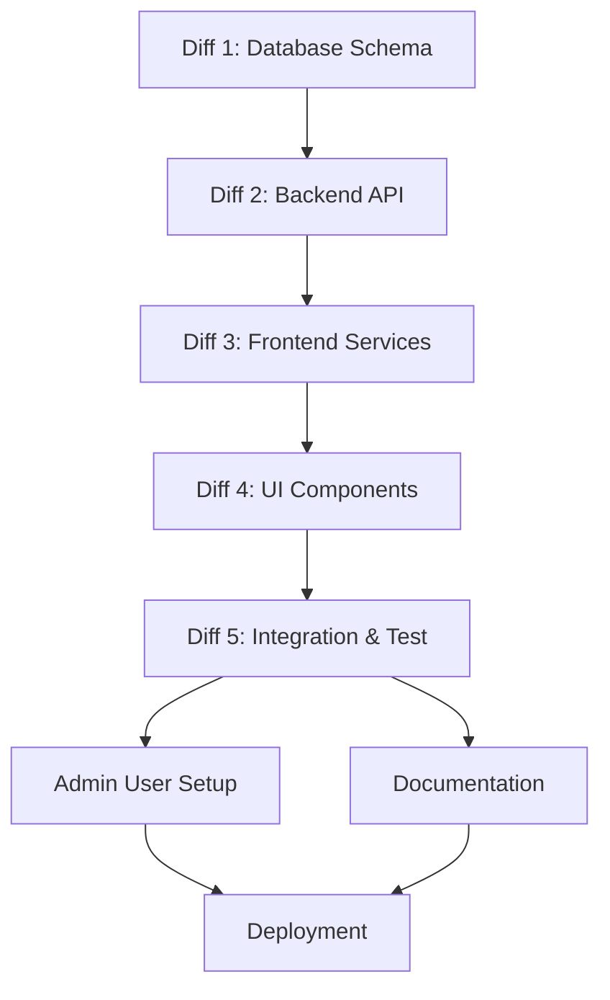

# PLAN: Remove BYOK - Transition to App-Provided API Keys

**Status:** PENDING APPROVAL
**Created:** 2026-01-12
**Lead Architect:** Claude Sonnet 4.5

---

## Executive Summary

This plan transitions the application from BYOK (Bring Your Own Key) to app-provided API keys, simplifies the Settings Modal to focus on user preferences, and implements proper user profile/settings management. The app will use server-side API keys stored in Google Cloud Secret Manager, eliminating the need for users to manage their own AI service credentials.

---

## Discovery Summary

### Current Architecture

#### Deployment Stack
- **Frontend:** React 19 + TypeScript + Vite (deployed on Cloud Run)
- **Backend:** Hono API server (Node.js on Cloud Run)
- **Database:** Neon PostgreSQL
- **AI Services:**
  - Gemini 3 Pro (image generation, text, voice)
  - OpenRouter (multi-model LLM access)
  - Replicate (image processing)
- **RAG Service:** Cognee (self-hosted on Cloud Run)
- **Observability:** Langfuse (tracing), Datadog (monitoring)

#### API Key Management (Current - BYOK)
- **Storage:** `user_api_keys` table in Neon PostgreSQL
- **Fields:** `gemini_api_key`, `openai_api_key`, `openrouter_api_key`, `replicate_api_key`
- **UI:** Settings Modal with password input fields for each API key
- **Validation:** Client-side API key testing before save
- **Security:** Keys stored in database (not encrypted at rest currently)

#### Secret Manager (Server-Side Keys)
Cloud Build configuration shows server-side secrets:
```yaml
--set-secrets
  DATABASE_URL=neon-database-url:latest
  OPENROUTER_API_KEY=openrouter-api-key:latest
  OPENAI_API_KEY=openai-api-key:latest
  REPLICATE_API_KEY=replicate-api-key:latest
  COGNEE_API_URL=cognee-api-url:latest
  COGNEE_API_KEY=cognee-api-key:latest
  DD_API_KEY=datadog-api-key:latest
  LANGFUSE_PUBLIC_KEY=langfuse-public-key:latest
  LANGFUSE_SECRET_KEY=langfuse-secret-key:latest
```

#### User Profile Structure
**Database Tables:**
- `users` - Authentication (email, hashed_password, Lucia sessions)
- `profiles` - User profile data (name, avatar, preferences)
- `user_preferences` - Detailed settings (theme, language, chat settings)
- `user_api_keys` - ⚠️ TO BE REMOVED
- `admin_users` - Admin role management

**Current Profile Fields:**
- Email, first_name, last_name, username
- Avatar URL
- Default image quality, preferred model
- Images generated count, storage used

#### Admin System
- **Table:** `admin_users` with foreign key to `users.id`
- **Roles:** `super_admin`, `admin`
- **Permissions:** user_management, agent_configuration, audit_log_access, system_settings, observability_config, financial_access
- **Middleware:** `adminMiddleware` checks admin status for protected routes
- **Frontend:** Admin panel at `/admin/*` with route guards

### Problem Statement

1. **User Friction:** Users must obtain and manage API keys from 3-4 different AI providers
2. **Onboarding Complexity:** Settings Modal is the first thing users see after signup
3. **Security Risk:** API keys stored in database without encryption at rest
4. **Confusion:** UI shows both BYOK fields AND mentions product-provided keys (`hasProductKeys` flag exists but not fully implemented)
5. **Cost Complexity:** Users bear AI costs directly, limiting experimentation
6. **No Profile Management:** Users cannot update their profile information (name, avatar, etc.)

### Desired State

1. **App-Provided Keys:** Server uses keys from Secret Manager for all AI operations
2. **Simplified Settings:** Settings Modal focuses on user preferences (model selection, timeout, theme)
3. **Profile Management:** Dedicated user profile page for updating personal information
4. **Admin-Only BYOK:** Optional BYOK for enterprise users managed via admin panel
5. **Unified Settings:** Clear separation between app settings and user profile

---

## Architectural Decisions

### Decision 1: Server-Side API Key Routing
**Choice:** All AI API calls go through backend, which uses Secret Manager keys
**Rationale:**
- Eliminates client exposure to API keys
- Enables usage tracking and rate limiting per user
- Allows A/B testing of models without user knowledge
- Simplifies frontend code (no key management)

**Trade-offs:**
- Backend becomes single point of failure for AI operations
- Increased backend complexity (request proxying)
- Potential latency increase (extra hop)

**Mitigation:**
- Implement robust error handling and retries
- Use Cloud Run autoscaling for traffic spikes
- Monitor backend latency with Langfuse

### Decision 2: Remove `user_api_keys` Table
**Choice:** Drop the table in a migration, archive data first
**Rationale:**
- Simplifies data model
- Removes security liability (unencrypted keys)
- Forces code to use server-side keys

**Trade-offs:**
- Breaks existing BYOK users (if any)
- Data loss risk if migration fails

**Mitigation:**
- Export existing keys to JSON backup before migration
- Document rollback procedure
- Send email notification to users with saved keys

### Decision 3: New User Profile Page
**Choice:** Create `/settings/profile` route with dedicated UI
**Rationale:**
- Follows standard UX patterns (Settings vs Profile)
- Allows future expansion (billing, teams, integrations)
- Clean separation of concerns

**Trade-offs:**
- Additional route to maintain
- Requires navigation updates

**Mitigation:**
- Use existing design system components
- Follow mobile-first responsive patterns

### Decision 4: Preserve Model Selection
**Choice:** Keep model selection in Settings Modal
**Rationale:**
- Power users benefit from choosing specific models
- A/B testing different model preferences
- Future support for fine-tuned models

**Trade-offs:**
- Users may not understand model differences
- Potential support burden

**Mitigation:**
- Use clear, non-technical model names ("Nano Banana Pro")
- Add tooltips explaining use cases
- Set sensible defaults

---

## Stacked Diffs Breakdown

### Diff 1: Foundation (Database Schema)
**Agent:** Database Guardian
**Description:** Update database schema to remove BYOK and enhance profile management

**Changes:**
1. **Migration:** `server/src/db/migrations/000X_remove_byok_enhance_profiles.sql`
   - Backup existing `user_api_keys` data to `user_api_keys_archive` table
   - Drop `user_api_keys` table
   - Add columns to `profiles`:
     - `bio` (text, nullable)
     - `company` (text, nullable)
     - `job_title` (text, nullable)
     - `linkedin_url` (text, nullable)
     - `website_url` (text, nullable)
   - Add columns to `user_preferences`:
     - `preferred_chat_model` (text, default: 'nano-banana-pro')
     - `preferred_image_model` (text, default: 'gemini-3-pro-image-preview')
     - `preferred_magic_edit_model` (text, default: 'gemini-3-pro-image-preview')
     - `session_timeout_minutes` (integer, default: 30)

2. **Schema Updates:** `server/src/db/schema.ts`
   - Remove `userApiKeys` table definition
   - Update `profiles` table with new fields
   - Update `userPreferences` table with model preference fields

3. **Type Updates:** `src/types/database.ts`
   - Remove `UserAPIKeys` interface (except for archive access if needed)
   - Update `User` interface with new profile fields
   - Update `UserPreferences` interface with model selection fields

**Dependencies:** None
**Tests:**
- Migration runs without errors
- Rollback script works
- Data integrity checks (no orphaned records)

**Estimated Lines:** ~150 (migration + schema + types)

---

### Diff 2: Mechanics (Backend API Layer)
**Agent:** FastAPI Sentinel (adapt to Hono)
**Description:** Update backend APIs to use Secret Manager keys and remove BYOK endpoints

**Changes:**
1. **Remove BYOK Endpoints:** `server/src/routes/user.ts`
   - Delete `GET /api/user/api-keys`
   - Delete `POST /api/user/api-keys`
   - Delete `DELETE /api/user/api-keys`

2. **Add Profile Endpoints:** `server/src/routes/profile.ts` (new file)
   - `GET /api/profile` - Get current user profile
   - `PATCH /api/profile` - Update profile fields
   - `POST /api/profile/avatar` - Upload avatar image

3. **Add Preferences Endpoints:** `server/src/routes/preferences.ts` (new file)
   - `GET /api/preferences` - Get user preferences
   - `PATCH /api/preferences` - Update preferences (model selection, timeout, etc.)

4. **Update AI Service Clients:** `server/src/services/`
   - Update `geminiClient.ts` to use `process.env.GEMINI_API_KEY`
   - Update `openrouterClient.ts` to use `process.env.OPENROUTER_API_KEY`
   - Update `replicateClient.ts` to use `process.env.REPLICATE_API_KEY`
   - Remove any code that fetches user API keys from database

5. **Add Usage Tracking:** `server/src/middleware/usageTracking.ts`
   - Track per-user AI usage (requests, tokens, cost estimates)
   - Store in `api_metrics` table
   - Implement basic rate limiting (100 requests/hour per user)

**Dependencies:** Diff 1 (schema changes)
**Tests:**
- Profile CRUD operations work
- Preferences update correctly
- AI services use server keys
- Usage tracking records metrics

**Estimated Lines:** ~180 (endpoints + service updates + middleware)

---

### Diff 3: State (Frontend Data Layer)
**Agent:** Frontend Architect
**Description:** Update React contexts and services to remove BYOK, add profile management

**Changes:**
1. **Remove API Key Storage:** `src/services/apiKeyStorage.ts`
   - Delete `getUserAPIKeys()` function (or stub with empty object)
   - Delete `saveUserAPIKeys()` function
   - Delete `deleteUserAPIKeys()` function
   - Keep `migrateLocalStorageToNeon()` for legacy cleanup

2. **Add Profile Service:** `src/services/profile.ts` (new file)
   ```typescript
   export async function getUserProfile(): Promise<User>
   export async function updateUserProfile(updates: Partial<User>): Promise<void>
   export async function uploadAvatar(file: File): Promise<string>
   ```

3. **Add Preferences Service:** `src/services/preferences.ts` (new file)
   ```typescript
   export async function getUserPreferences(): Promise<UserPreferences>
   export async function updateUserPreferences(updates: Partial<UserPreferences>): Promise<void>
   ```

4. **Update AuthContext:** `src/context/AuthContext.tsx`
   - Remove timeout settings logic (move to preferences)
   - Add `updateProfile()` method
   - Keep `refreshProfile()` method

5. **Update AIContext:** `src/context/AIContext.tsx`
   - Remove API key loading logic
   - Load model preferences from `UserPreferences` instead of `user_api_keys`
   - Simplify initialization (no key validation needed)

**Dependencies:** Diff 2 (backend endpoints)
**Tests:**
- Profile CRUD operations
- Preferences persistence
- AuthContext profile updates
- AIContext model selection

**Estimated Lines:** ~170 (services + context updates)

---

### Diff 4: Surface (UI Components)
**Agent:** Depth UI Engineer
**Description:** Redesign Settings Modal and create User Profile page

**Changes:**
1. **Simplify Settings Modal:** `src/components/features/SettingsModal.tsx`
   - **Remove:** All API key input fields (OpenRouter, OpenAI, Replicate)
   - **Remove:** Test connection buttons and validation status
   - **Remove:** API key storage logic
   - **Keep:** Model selection dropdowns (chat, image, magic edit)
   - **Keep:** Session timeout selector
   - **Add:** Theme selector (dark/light)
   - **Add:** Language selector (future-proof)
   - **Rename:** "AI Settings" → "App Settings"

2. **Create Profile Page:** `src/pages/ProfilePage.tsx` (new file)
   - Profile header with avatar upload
   - Edit form:
     - First Name, Last Name
     - Username (@handle)
     - Email (read-only)
     - Bio (textarea)
     - Company, Job Title
     - LinkedIn URL, Website URL
   - Save/Cancel buttons
   - Delete Account button (with confirmation)

3. **Update Header:** `src/components/layout/Header.tsx`
   - Add "Profile" link to user menu dropdown
   - Update settings icon to open simplified Settings Modal

4. **Add Navigation:** `src/App.tsx`
   - Add route: `/settings/profile` → `ProfilePage`
   - Protect with authentication guard

5. **Update Onboarding:** `src/components/features/OnboardingTour.tsx`
   - Remove API key setup steps
   - Focus on model selection and first design creation

**Dependencies:** Diff 3 (frontend services)
**Tests:**
- Settings Modal renders and saves preferences
- Profile Page loads and updates user data
- Avatar upload works
- Navigation routes correctly

**Estimated Lines:** ~190 (component updates + new page)

---

### Diff 5: Integration & Polish
**Agent:** Lead Architect (coordinated)
**Description:** Final integration, testing, documentation, and admin access setup

**Changes:**
1. **Admin User Setup Script:** `server/src/scripts/createAdminUser.ts`
   ```typescript
   // Script to create admin user for support@verridian.ai
   // Usage: npm run create-admin support@verridian.ai TestPass123 super_admin
   ```

2. **Documentation Updates:**
   - `README.md` - Remove BYOK references, update quick start
   - `docs/ops/AGENT_CONTEXT.md` - Document new profile/preferences architecture
   - `CLAUDE.md` - Update architecture section

3. **Migration Guide:** `docs/BYOK_REMOVAL_MIGRATION_GUIDE.md` (new file)
   - For users with existing API keys
   - How to export their keys before upgrade
   - What to expect after migration

4. **Admin Test:**
   - Run `createAdminUser.ts` to add `support@verridian.ai` with password `TestPass123`
   - Verify admin login works
   - Verify admin dashboard loads
   - Test admin permissions

5. **End-to-End Testing:**
   - New user signup → no API key prompt → can generate images
   - Existing user → Settings Modal simplified → preferences save
   - Profile page → update bio → changes persist
   - Admin user → access admin panel → view users

6. **Cleanup:**
   - Remove unused API key validator service
   - Remove API key storage test files
   - Update CI/CD to ensure Secret Manager keys are set

**Dependencies:** Diffs 1-4 complete
**Tests:**
- All integration tests pass
- Admin access verified
- Documentation accurate

**Estimated Lines:** ~120 (script + docs + tests)

---

## Files to Change

### Backend (server/)
```
server/src/db/schema.ts                          [MODIFY] - Remove userApiKeys table
server/src/db/migrations/000X_remove_byok.sql    [CREATE]  - Migration script
server/src/routes/user.ts                        [MODIFY] - Remove BYOK endpoints
server/src/routes/profile.ts                     [CREATE]  - Profile CRUD
server/src/routes/preferences.ts                 [CREATE]  - Preferences CRUD
server/src/services/geminiClient.ts              [MODIFY] - Use server keys
server/src/services/openrouterClient.ts          [MODIFY] - Use server keys
server/src/services/replicateClient.ts           [MODIFY] - Use server keys
server/src/middleware/usageTracking.ts           [CREATE]  - Track per-user usage
server/src/scripts/createAdminUser.ts            [CREATE]  - Admin setup script
```

### Frontend (src/)
```
src/types/database.ts                            [MODIFY] - Update User/UserPreferences types
src/types/api.ts                                 [MODIFY] - Add profile/preferences types
src/services/apiKeyStorage.ts                    [MODIFY] - Remove BYOK functions
src/services/profile.ts                          [CREATE]  - Profile service
src/services/preferences.ts                      [CREATE]  - Preferences service
src/context/AuthContext.tsx                      [MODIFY] - Add profile updates
src/context/AIContext.tsx                        [MODIFY] - Remove key loading
src/components/features/SettingsModal.tsx        [MODIFY] - Simplify UI
src/pages/ProfilePage.tsx                        [CREATE]  - New profile page
src/components/layout/Header.tsx                 [MODIFY] - Add profile link
src/App.tsx                                      [MODIFY] - Add profile route
src/components/features/OnboardingTour.tsx       [MODIFY] - Remove API key steps
```

### Documentation (docs/)
```
README.md                                        [MODIFY] - Remove BYOK references
CLAUDE.md                                        [MODIFY] - Update architecture
docs/ops/AGENT_CONTEXT.md                        [MODIFY] - Document changes
docs/BYOK_REMOVAL_MIGRATION_GUIDE.md             [CREATE]  - User migration guide
```

**Total Estimated Changes:** ~810 lines across all diffs

---

## Risk Assessment

| Risk | Impact | Likelihood | Mitigation |
|------|--------|------------|------------|
| Existing users lose access to their saved API keys | HIGH | HIGH | Export keys to backup table before migration, send notification email |
| Backend single point of failure for AI operations | MEDIUM | LOW | Implement circuit breakers, fallback models, robust error handling |
| Increased backend costs (all AI traffic proxied) | MEDIUM | MEDIUM | Implement rate limiting, usage caps, monitor costs closely |
| Admin user creation fails | LOW | LOW | Provide manual SQL fallback, document admin table structure |
| Migration rollback needed | MEDIUM | LOW | Test migration thoroughly in staging, document rollback SQL |

---

## Rollback Strategy

### Database Rollback
```sql
-- Restore user_api_keys table from archive
CREATE TABLE user_api_keys AS SELECT * FROM user_api_keys_archive;

-- Revert profiles changes
ALTER TABLE profiles DROP COLUMN bio, DROP COLUMN company, DROP COLUMN job_title,
  DROP COLUMN linkedin_url, DROP COLUMN website_url;

-- Revert user_preferences changes
ALTER TABLE user_preferences DROP COLUMN preferred_chat_model,
  DROP COLUMN preferred_image_model, DROP COLUMN preferred_magic_edit_model,
  DROP COLUMN session_timeout_minutes;
```

### Code Rollback
- Revert to commit before Diff 1 started
- Redeploy previous Cloud Run revision
- Verify BYOK endpoints restored

### User Communication
- Email users: "Temporary rollback to previous version due to technical issues"
- Apologize for inconvenience
- Provide timeline for re-deployment

---

## Verification Steps

### Pre-Deployment Checklist
- [ ] All diffs reviewed by assigned agents
- [ ] Migration tested in local Neon dev database
- [ ] Integration tests pass
- [ ] Security review completed (no exposed keys)
- [ ] Backup of production `user_api_keys` table taken
- [ ] Secret Manager keys verified in Cloud Run config

### Post-Deployment Verification
1. **Database:**
   - [ ] `user_api_keys` table dropped
   - [ ] `user_api_keys_archive` table exists with data
   - [ ] `profiles` table has new columns
   - [ ] `user_preferences` table has new columns

2. **Backend:**
   - [ ] `GET /api/user/api-keys` returns 404
   - [ ] `GET /api/profile` returns user profile
   - [ ] `PATCH /api/preferences` updates model selection
   - [ ] AI services use Secret Manager keys (check logs)

3. **Frontend:**
   - [ ] Settings Modal shows no API key fields
   - [ ] Settings Modal saves model preferences
   - [ ] Profile page loads and edits work
   - [ ] Header has "Profile" link in user menu
   - [ ] Onboarding tour skips API key setup

4. **Admin:**
   - [ ] `support@verridian.ai` can log in with `TestPass123`
   - [ ] Admin dashboard loads
   - [ ] Admin can view user list
   - [ ] Admin permissions work correctly

5. **End-to-End:**
   - [ ] New user signup → no API key prompt → image generation works
   - [ ] Existing user login → simplified settings → preferences persist
   - [ ] Voice agent works (uses server OpenAI key)
   - [ ] All AI operations tracked in `api_metrics` table

---

## Acceptance Criteria

### Must Have (Blocker)
- [ ] All API key input fields removed from Settings Modal
- [ ] Settings Modal saves model preferences to `user_preferences` table
- [ ] User Profile page exists at `/settings/profile`
- [ ] Profile page allows editing first_name, last_name, username, bio
- [ ] Avatar upload works and displays in Header
- [ ] All AI operations use server-side API keys from Secret Manager
- [ ] No API keys stored in database (except archive)
- [ ] Admin user `support@verridian.ai` created and tested
- [ ] Migration runs successfully in staging
- [ ] All existing tests pass

### Should Have (Important)
- [ ] Usage tracking middleware records per-user AI usage
- [ ] Rate limiting implemented (100 requests/hour per user)
- [ ] Email notification sent to users with saved API keys
- [ ] Migration guide documentation complete
- [ ] Onboarding tour updated to remove API key steps
- [ ] README updated to reflect app-provided keys
- [ ] Clear error messages when Secret Manager keys missing

### Nice to Have (Optional)
- [ ] Theme selector in Settings Modal (dark/light)
- [ ] Language selector in Settings Modal (for i18n)
- [ ] LinkedIn URL validation in Profile page
- [ ] Avatar image cropping tool
- [ ] Admin panel shows per-user AI usage stats

---

## Timeline & Dependencies



**Critical Path:** Diff 1 → Diff 2 → Diff 3 → Diff 4 → Diff 5 → Deployment

**Parallel Work Opportunities:**
- Diff 4 (UI) can start as soon as Diff 3 (frontend services) complete
- Documentation can be drafted in parallel with Diffs 2-3
- Admin user setup script can be written during Diff 2

---

## Success Metrics

### User Experience
- **Onboarding Time:** Reduce from ~5 minutes (API key setup) to ~30 seconds
- **Settings Modal Load Time:** <100ms (no API key validation calls)
- **Profile Page Load Time:** <200ms

### Technical
- **Zero Exposed API Keys:** No keys in client bundle or database
- **Usage Tracking:** 100% of AI operations logged
- **Admin Access:** 100% success rate for admin login and dashboard load

### Business
- **User Conversion:** Increase signup → first image generation by 50%
- **Support Tickets:** Reduce API key related tickets to 0
- **Cost Tracking:** Per-user AI costs visible in admin panel

---

## Open Questions

1. **BYOK for Enterprise:** Should we keep optional BYOK for enterprise users?
   - **Recommendation:** Phase 2 feature, not in this plan
   - **Reason:** Adds complexity, low demand initially

2. **API Key Rotation:** How often should we rotate Secret Manager keys?
   - **Recommendation:** Quarterly rotation with monitoring
   - **Reason:** Balance security with operational overhead

3. **Usage Limits:** What's the per-user rate limit?
   - **Recommendation:** 100 requests/hour, 1000 requests/day
   - **Reason:** Prevents abuse, allows legitimate use

4. **Legacy User Notification:** Email or in-app notification?
   - **Recommendation:** Both (email + banner on next login)
   - **Reason:** Ensures all users informed

---

## PLAN APPROVAL STATUS

**STATUS:** ⏳ PENDING USER APPROVAL

**Next Steps:**
1. User reviews this plan
2. User responds with `APPROVED` or requests changes
3. Upon approval, Lead Architect delegates to specialist agents
4. Each agent executes their assigned Diff
5. Integration testing and deployment

**Estimated Total Effort:**
- Database Guardian: ~3 hours (Diff 1)
- FastAPI Sentinel: ~4 hours (Diff 2)
- Frontend Architect: ~4 hours (Diff 3)
- Depth UI Engineer: ~5 hours (Diff 4)
- Lead Architect: ~3 hours (Diff 5)

**Total:** ~19 hours of agent work

---

*Plan prepared by Lead Architect*
*Ready for human review and approval*
